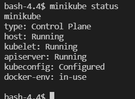
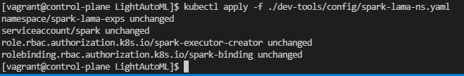
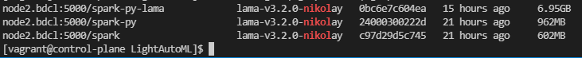
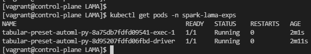
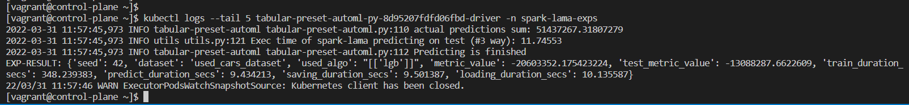
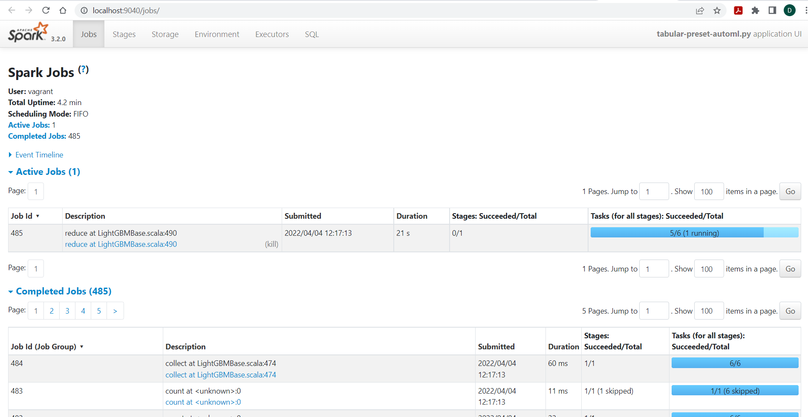

Deploy on Minikube
==================

1. On a host with Linux operating system and amd64 architecture, run the following commands: ::

    curl -LO https://storage.googleapis.com/minikube/releases/latest/minikube-linux-amd64
    sudo install minikube-linux-amd64 /usr/local/bin/minikube

 For other operating systems and architectures, one should follow the `official guide <https://kubernetes.io/ru/docs/tasks/tools/install-minikube/>`_.

2. Start minikube:

::

    minikube start –cpus 12 –memory 20000 –driver=docker

Setting of cpus and memory is up to you.

3. Check minikube status: ::

    minikube status

All services should be in running state:

Environment setup
=================

1. Clone LigthAutoML repository.

2. Check Python is installed on the host.

3. Download libraries required to be installed on the host: ::

    pip install pyspark
    pip install poetry

5. Create several folders to be used for data storage and particulary for pv (PersistentVolume) and pvc (PersistentVolumeClaim):
   One may choose different paths. All described below is just a suggestion. 

    * /opt/data-slama - dataset folder. All required datasets, one is planning to work with, 
      should be copied in this folder.

    * /opt/result-slama - service folder for intermediate data

    * /tmp/slama - temporary files folder

6. Mount the folders mentioned earlier into minikube: ::

    minikube mount <source>:<dest>

!! Не рабоатет на ОС не поддерживающих файловую систему 9p

7. Create a namespace and a service account in K8s to run SLAMA application and give it ability to create executor pods.
   Take a look on examples in ~/LightAutoML/dev-tools/config/spark-lama-ns.yaml. ::

    kubectl apply -f ./dev-tools/config/spark-lama-ns.yaml

Results of the command execution should look like:

Instead of 'unchanged' state there may be 'created' state if nothing existed before this command was executed.

8. Create pv and pvc to be used by spark application with SLAMA. It is assumed that the folders previously created 
   will be used for this purpose. One may take a look on the example 
   ~/LightAutoML/dev-tools/config/spark-lama-data-pv-pvc.yaml to create pv and pvc. ::

    kubectl apply -f ./dev-tools/config/spark-lama-data-pv-pvc.yaml

8. Setup environment variables to be used with slamactl.sh utility: ::

    export KUBE_NAMESPACE=spark-lama-exps
    export REPO=node2.bdcl:5000

9. Build required images: ::

    ./bin/slamactl.sh build-dist
    ./bin/slamactl.sh build-lama-image

10. One can check resulting images with the command: ::
    
    docker images

11. Upload required datasets into the folder of pv spark-lama-data.

Run examples in minikube
========================

1. Ensure that REPO and KUBE_NAMESPACE variables are set. 
   Ensure that all required docker images and kubernetes objects have been created.

2. Go to LigthAutoML folder.

3. Run an example with slamactl.sh: ::

    ./bin/slamactl.sh submit-job ./examples/spark/tabular-preset-automl.py

4. Check state of SLAMA application's pods with command ``kubectl get pods -n spark-lama-exps``:

5. Check the result of execution when the driver pod is completed with: ::

    kubectl logs --tail 5 tabular-preset-automl-py-8d95207fdfd06fbd-driver -n spark-lama-exps

An example of the result:

6. One can open Spark Web UI of SLAMA application on localhost. 
   That requires to execute a command for port forwarding to one of localhost ports: ::

    kubectl -n spark-lama-exps port-forward svc/$(kubectl -n spark-lama-exps get svc -o jsonpath='{.items[0].metadata.name}') 9040:4040 --address='0.0.0.0'

To open Spark WebUI follow the link <http://localhost:9040>

Note: SLAMA application should be in running state. 
