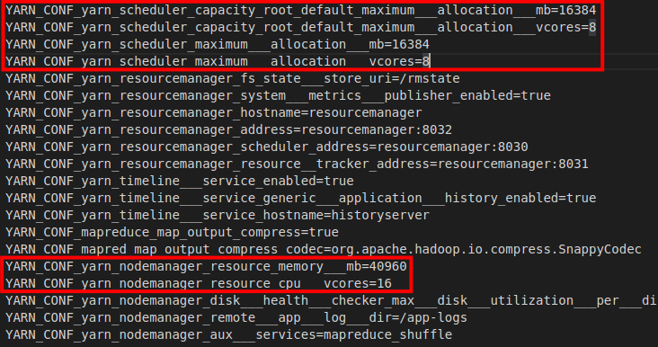
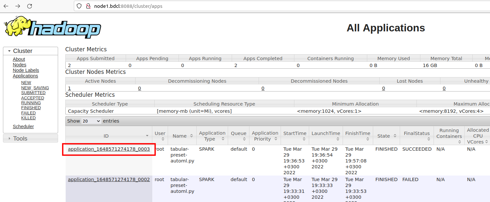
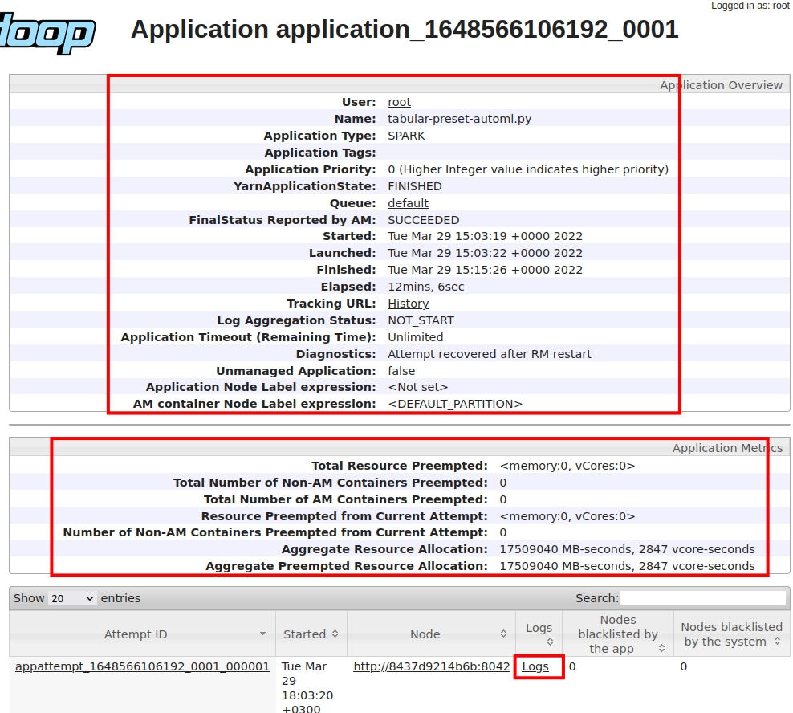
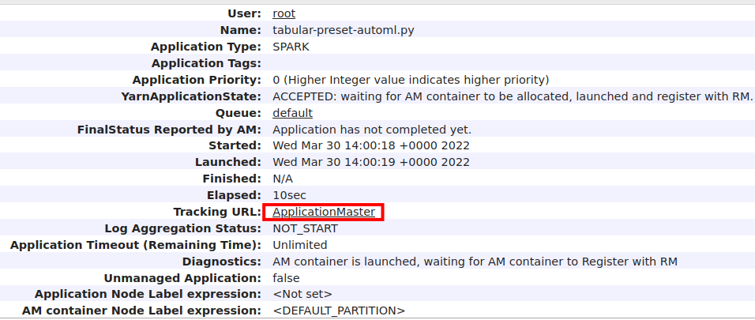

Running spark lama app on Spark YARN
====================================

.. Run on local Hadoop YARN
.. ^^^^^^^^^^^^^^^
Next, it will be shown how to run the ``examples/spark/tabular-preset-automl.py`` script for execution on local Hadoop YARN.

Local deployment of Hadoop YARN is done using the docker-hadoop project from the https://github.com/big-data-europe/docker-hadoop repository. It consists of the following services: datanode, historyserver, namenode, nodemanager, resourcemanager. The files ``docker-hadoop/nodemanager/Dockerfile``, ``docker-hadoop/docker-compose.yml`` have been modified and a description of the new service ``docker-hadoop/spark-submit`` has been added. Required tools to get started to work with docker-hadoop project: Docker, Docker Compose and GNU Make. 

1. First, let's go to the LightAutoML project directory
^^^^^^^^^^^^^^^^^^^^^^^^^^^^^^^^^^^^^^^^^^^^^^^^^^^^^^^
.. image:: imgs/LightAutoML_repo_files.png

Make sure that in the ``dist`` directory there is a wheel assembly and in the ``jars`` directory there is a jar file.

If the ``dist`` directory does not exist, or if there are no files in it, then you need to build lama dist files. ::

./bin/slamactl.sh build-lama-dist

If there are no jar file(s) in ``jars`` directory, then you need to build lama jar file(s). ::

./bin/slamactl.sh build-jars

2. Distribute lama wheel to nodemanager
^^^^^^^^^^^^^^^^^^^^^^^^^^^^^^^^^^^^^^^
Copy lama wheel file from ``dist/LightAutoML-0.3.0-py3-none-any.whl`` to ``docker-hadoop/nodemanager/LightAutoML-0.3.0-py3-none-any.whl``.
We copy the lama wheel assembly to the nodemanager Docker file, because later it will be needed in the nodemanager service to execute the pipelines that we will send to spark. ::

    cp dist/LightAutoML-0.3.0-py3-none-any.whl docker-hadoop/nodemanager/LightAutoML-0.3.0-py3-none-any.whl

3. Go to ``docker-hadoop`` directory
^^^^^^^^^^^^^^^

::

    cd docker-hadoop

4. Open ``docker-compose.yml`` file and configure services.
^^^^^^^^^^^^^^^

::
    
    nano docker-compose.yml

Edit ``volumes`` setting to mount directory with datasets to ``nodemanager`` service.

.. image:: imgs/docker_compose_setting.png

5. Open ``hadoop.env`` file and configure hadoop settings.
^^^^^^^^^^^^^^^
Pay attention to the highlighted settings. They need to be set in accordance with the resources of your computers.

6. Build image for ``nodemanager`` service.
^^^^^^^^^^^^^^^
The following command will build the ``nodemanager`` image according to ``docker-hadoop/nodemanager/Dockerfile``. Python 3.9 and the installation of the lama wheel package has been added to this Dockerfile.
::
    
    make build-nodemanager-with-python

7. Build image for ``spark-submit`` service.
^^^^^^^^^^^^^^^^^^^^^^^^^^^^^^^^^^^^^^^^^^^^
The ``spark-submit`` container will be used to submit our applications for execution. ::

    make build-image-to-spark-submit

8. Start Hadoop YARN services
^^^^^^^^^^^^^^^^^^^^^^^^^^^^^
::

    docker-compose up

or same in detached mode::

    docker-compose up -d

Check that all services have started::

    docker-compose ps

.. image:: imgs/docker_compose_ps.png

Here ``datanode``, ``historyserver``, ``namenode``, ``nodemanager``, ``resourcemanager`` is services of Hadoop. ``namenode`` and ``datanode`` is parts of HDFS. ``resourcemanager``, ``nodemanager`` and ``historyserver`` is parts of YARN. For more information see the documentation at https://hadoop.apache.org/docs/r1.2.1/hdfs_design.html and https://hadoop.apache.org/docs/stable/hadoop-yarn/hadoop-yarn-site/YARN.html.

``spark-submit`` is service to submitting our applications to Hadoop YARN for execution (see step 9).

If one of the services did not up, then you need to look at its logs. For example ``resourcemanager`` logs. ::

    docker-compose logs -f resourcemanager

9. Send job to cluster via ``spark-submit`` container
^^^^^^^^^^^^^^^^^^^^^^^^^^^^^^^^^^^^^^^^^^^^^^^^^^^^^

::
    
    docker exec -ti spark-submit bash -c "./bin/slamactl.sh submit-job-yarn dist/LightAutoML-0.3.0.tar.gz,examples/spark/examples_utils.py examples/spark/tabular-preset-automl.py"

10. Monitoring application execution
^^^^^^^^^^^^^^^^^^^^^^^^^^^^^^^^^^^^
To monitor application execution, you can use the hadoop web interface (http://localhost:8088), which displays the status of the application, resources and application logs.

Let's see the information about the application and its logs.

.. image:: imgs/hadoop_view_application1.png

.. image:: imgs/hadoop_application_logs.png

11. Spark WebUI
^^^^^^^^^^^^^^^
When the application is running, you can go to the hadoop web interface and get a link to the Spark WebUI.

.. image:: imgs/spark_web_ui.png

12. HDFS Web UI
^^^^^^^^^^^^^^^
HDFS Web UI is available at http://localhost:9870.
Here you can browse your files in HDFS http://localhost:9870/explorer.html. HDFS stores trained pipelines and Spark application files.

.. image:: imgs/hdfs_web_ui.png

